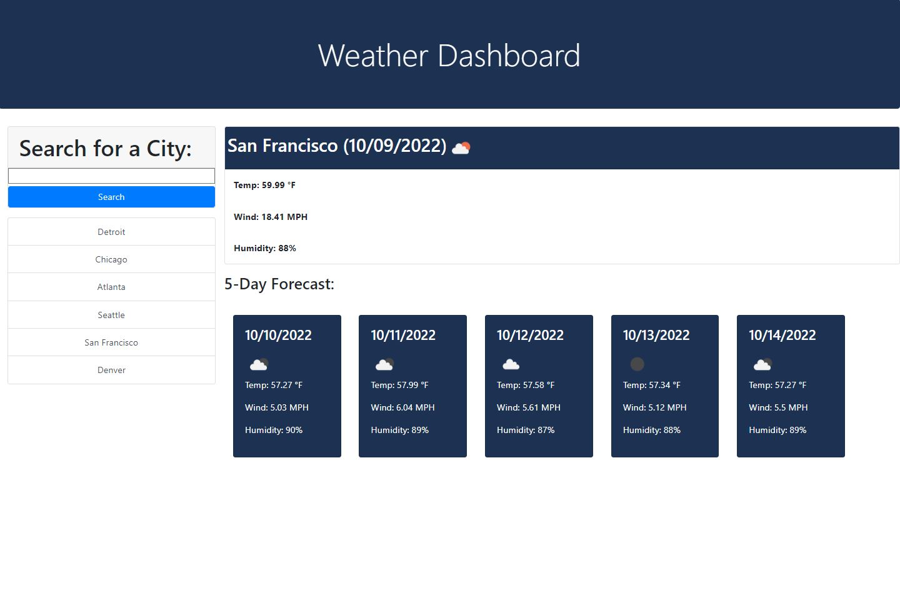

# weather-dashboard

## Description

The motivation of this project is to build a weather dashboard web application that displays the current weather and 5 day forecast for a city. The focus of this project is to use server-side APIs (in this case OpenWeatherMap API) to retrieve data and use it in the context of our application. It features dynamically updated HTML and CSS powered by jQuery. This activity also reinforces concepts such as third party APIs, local storage, and JSON formatting. Also an important concept covered in this activity is using the documentation from the OpenWeatherMap API to understand how to retrieve data and implement it into our code. 

Link to Website: https://seangshin.github.io/weather-dashboard/

## Installation

The following tools were used for the development and testing of this project. Web Browser (Google Chrome preferred) Code development IDE (Microsoft VS Code)

## Usage

Open HTML and CSS code using Code development IDE. Open HTML using Web Browser.

## Credits

Georgia Tech Coding Bootcamp instructors, TA's, and other faculty. Third party APIs Bootstrap, jQuery, Moment.js. Server side API OpenWeatherMap.

## License

Not applicable